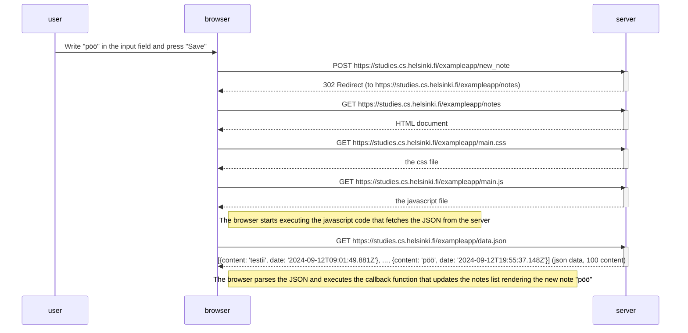

```mermaid
sequenceDiagram
    participant user
    participant browser
    participant server

    %% User writes a note "pöö" and submits the form
    user->>browser: Write "pöö" in the input field and press "Save"

    %% Browser sends a POST request to the server with note form data
    browser->>server: POST https://studies.cs.helsinki.fi/exampleapp/new_note
    activate server

    %% Server responds with a 302 redirect to https://studies.cs.helsinki.fi/exampleapp/notes page
    server-->>browser: 302 Redirect (to https://studies.cs.helsinki.fi/exampleapp/notes)
    deactivate server

    %% Browser reloads the https://studies.cs.helsinki.fi/exampleapp/notes page with a new GET request
    browser->>server: GET https://studies.cs.helsinki.fi/exampleapp/notes
    activate server
    server-->>browser: HTML document
    deactivate server
    
    %% Browser fetches the css file to style the page
    browser->>server: GET https://studies.cs.helsinki.fi/exampleapp/main.css
    activate server
    server-->>browser: the css file
    deactivate server

    %% Browser fetches the javaScript file to run the application logic / functionality
    browser->>server: GET https://studies.cs.helsinki.fi/exampleapp/main.js
    activate server
    server-->>browser: the javascript file
    deactivate server

    Note right of browser: The browser starts executing the javascript code that fetches the JSON from the server

    %% javascript sends a GET request for the data.json (notes list in json)
    browser->>server: GET https://studies.cs.helsinki.fi/exampleapp/data.json
    activate server
    %% Server responds with the JSON data, including the new note "pöö"
    server-->>browser: [{content: 'testii', date: '2024-09-12T09:01:49.881Z'}, ..., {content: 'pöö', date: '2024-09-12T19:55:37.148Z'}] (json data, 100 content)
    deactivate server
    
    Note right of browser: The browser parses the JSON and executes the callback function that updates the notes list rendering the new note "pöö"
```
