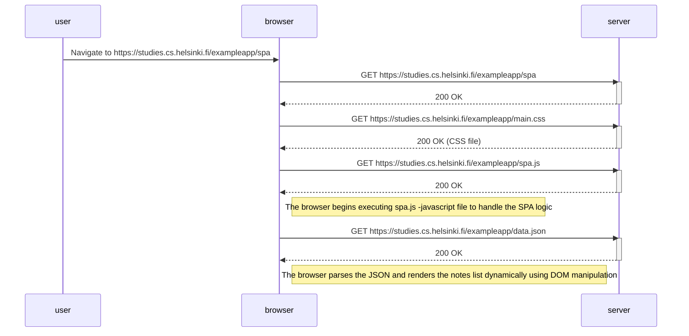

```mermaid
sequenceDiagram
    participant user
    participant browser
    participant server

    %% User navigates to the SPA version of the notes app
    user->>browser: Navigate to https://studies.cs.helsinki.fi/exampleapp/spa

    %% Browser sends a GET request to the server for the SPA HTML document
    browser->>server: GET https://studies.cs.helsinki.fi/exampleapp/spa
    activate server
    server-->>browser: 200 OK
    deactivate server

    %% Browser fetches css
    browser->>server: GET https://studies.cs.helsinki.fi/exampleapp/main.css
    activate server
    server-->>browser: 200 OK (CSS file)
    deactivate server

    %% Browser fetches javascript
    browser->>server: GET https://studies.cs.helsinki.fi/exampleapp/spa.js
    activate server
    server-->>browser: 200 OK
    deactivate server

    Note right of browser: The browser begins executing spa.js -javascript file to handle the SPA logic

    %% javascript sends a GET request to fetch the existing notes as JSON
    browser->>server: GET https://studies.cs.helsinki.fi/exampleapp/data.json
    activate server
    server-->>browser: 200 OK
    deactivate server
    
    Note right of browser: The browser parses the JSON and renders the notes list dynamically using DOM manipulation
```
