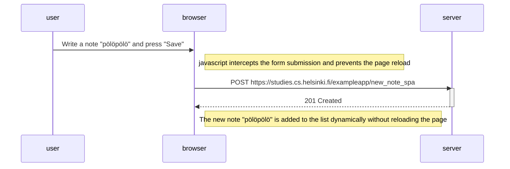

```mermaid
sequenceDiagram
    participant user
    participant browser
    participant server

    %% User writes a new note "pölöpölö" and submits the form without reloading the page
    user->>browser: Write a note "pölöpölö" and press "Save"
    
    Note right of browser: javascript intercepts the form submission and prevents the page reload

    %% javascript sends a POST request to the server with the new note data as JSON with content and date
    %% {content: "pölöpölö", date: "2024-09-12T22:11:05.238Z"}
    browser->>server: POST https://studies.cs.helsinki.fi/exampleapp/new_note_spa
    activate server
    %% {"message": "note created"}
    server-->>browser: 201 Created
    deactivate server
    
    Note right of browser: The new note "pölöpölö" is added to the list dynamically without reloading the page
```
